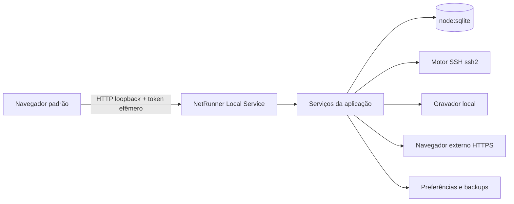

# Arquitetura

## Visão geral

## Processo local

O serviço Node concentra todas as operações privilegiadas: banco, SSH, logs, importação, backup e abertura controlada de URLs. Ele escuta exclusivamente em `127.0.0.1` e usa uma porta dinâmica atribuída pelo sistema operacional.

## Interface web

A interface é servida pelo próprio processo. Não há CDN, service worker ou asset externo. O navegador não recebe acesso direto ao filesystem, SQLite ou sockets SSH.

## Sessão local

Ao iniciar, o serviço gera 32 bytes aleatórios e abre o navegador com o token no fragmento da URL. Fragmentos não são enviados no request HTTP. O JavaScript consome o token, remove o fragmento do histórico e mantém o valor apenas em memória.

Todas as APIs exigem `Authorization: Bearer`. Requisições também passam por validação do cabeçalho `Host` e, quando presente, `Origin`. Não são enviados cabeçalhos CORS permissivos.

A interface mantém um stream HTTP autenticado exclusivo para acompanhar seu ciclo de vida. Cada aba aberta registra uma conexão; o fechamento da última conexão agenda o encerramento do serviço local. Uma pequena janela de tolerância permite reconexão transitória sem derrubar o processo. O fechamento manual por sinal continua idempotente e encerra sessões SSH, servidor e banco na ordem correta.

## Persistência

O inventário usa `node:sqlite`, evitando módulos nativos adicionais. Os dados permanecem em `~/Library/Application Support/NetRunner`, com diretório `0700` e banco `0600`. O banco opera em WAL, com chaves estrangeiras, `busy_timeout`, exclusão segura, migrações transacionais e `integrity_check` na abertura.

O esquema contém localidades hierárquicas, usernames, dispositivos, tags, configurações, histórico de sessões e um índice FTS5 separado. O serviço atualiza o índice de busca na mesma transação que altera o inventário.

Ao iniciar, o processo serializa uma cópia consistente em `Backups/netrunner-AAAA-MM-DD.sqlite`. Só é criado um arquivo por dia e os 14 mais recentes são mantidos. Backups manuais usam a mesma serialização. Uma restauração é primeiro validada por integridade e esquema, gravada como intenção privada e aplicada somente antes da abertura normal do banco na próxima inicialização. O estado anterior é serializado em um backup de emergência antes da troca.

## Preferências

Preferências ficam na tabela `settings`, nunca em `localStorage`, `sessionStorage` ou IndexedDB. O serviço valida cada chave por allowlist, tipo e limite. Mudanças de timeout são propagadas às sessões SSH existentes; preferências visuais são aplicadas pela interface e pelo xterm sem modificar o stream gravado.

Os temas são definidos por tokens CSS locais. A paleta de comandos consulta apenas o estado já carregado do inventário e não envia conteúdo a serviços externos.

## API de inventário

As rotas sob `/api/` compartilham os controles de token, `Host` e `Origin`. Corpos de escrita aceitam apenas JSON e têm limite de 12 MiB. Validação, regras de hierarquia e transações ficam no processo local; a interface recebe apenas objetos já normalizados.

Importações CSV/JSON são analisadas e apresentadas como prévia antes da aplicação. A aplicação ocorre em transação única. CSV aceita vírgula ou ponto e vírgula, UTF-8 com ou sem BOM, e também um arquivo contendo somente caminhos de localidades.

## Terminal

O processo local realiza todas as conexões com `ssh2`. A interface nunca abre sockets para os equipamentos: envia entrada, resize e decisões de autenticação para a API autenticada, e recebe eventos por long polling. Essa escolha evita um servidor WebSocket adicional e mantém os mesmos controles de token, `Host` e `Origin`.

Cada sessão possui um buffer de eventos limitado. Saída UTF-8 é transportada em base64 para preservar bytes; ISO-8859-1 é convertida explicitamente. A interface usa xterm com Fit, Search, Unicode 11, Web Links controlado e WebGL com fallback para o renderer DOM.

Senhas e respostas de autenticação são campos transitórios: não entram no estado global da interface, nos eventos de sessão ou nas respostas da API. O gerenciador mantém no máximo 20 sessões ativas.

## Host keys e autenticação

O `hostVerifier` pausa o handshake na primeira conexão. A fingerprint SHA-256 e o tipo são apresentados ao usuário; a conexão só continua depois do aceite. Uma fingerprint diferente da registrada também pausa, mas exige a ação distinta de substituição. A tabela `known_hosts` guarda host, porta, tipo, fingerprint e datas — nunca a senha.

O cliente inicia com `none` para descobrir os métodos anunciados. Em seguida faz uma única tentativa por senha digitada, preferindo `keyboard-interactive` quando oferecido para suportar OTP sem reenviar automaticamente a senha. O modo login no shell aceita somente `none` e entrega os prompts ao terminal.

## Gravação de sessão

O único ponto de entrada do gravador é o stream recebido do equipamento em `#emitOutput`; o caminho de entrada do usuário não possui referência ao gravador. Cada sessão mantém até 2 MiB de saída em memória para permitir início tardio deliberado.

`@xterm/headless` interpreta o mesmo fluxo VT e as mesmas dimensões do terminal visual. O normalizador extrai linhas lógicas, elimina sequências ANSI, aplica backspaces/cursor, junta wraps artificiais e remove marcadores conhecidos de paginação. O TXT é escrito incrementalmente e sincronizado periodicamente.

O índice SQLite é criado para toda conexão, gravada ou não. Um log finalizado recebe rodapé, `fsync`, SHA-256 calculado por streaming e sidecar compatível com `shasum`; TXT e sidecar passam a `0400`. Diretórios permanecem `0700`. Na inicialização, registros sem término recebem rodapé de encerramento inesperado e um novo hash.

As APIs de histórico só abrem caminhos armazenados no índice e contidos na raiz de logs. Abrir ou revelar no Finder é uma ação explícita do usuário.

## Perfis SSH

Os perfis são listas exatas validadas antes da conexão. Moderno contém apenas algoritmos atuais; Legado acrescenta SHA-1/CBC/3DES e chaves antigas mediante opt-in por dispositivo. Personalizado aceita somente itens do catálogo permitido. Cifra `none`, RC4, Blowfish, CAST e MACs MD5 não existem no catálogo.

## HTTPS

Interfaces HTTPS são abertas no navegador padrão após uma inspeção TLS feita pelo processo local. O probe estabelece somente o handshake com TLS 1.2 ou superior, coleta fingerprint SHA-256, emissor, assunto, validade, protocolo e cifra, e encerra o socket sem fazer requisição HTTP.

Certificados não reconhecidos pelo sistema usam fixação TOFU por dispositivo, host e porta. A primeira fingerprint exige confirmação explícita; uma mudança é bloqueada até substituição deliberada. Antes do handoff, o certificado é inspecionado novamente e precisa coincidir com a fingerprint apresentada na confirmação.

O processo usa `/usr/bin/open` somente após ação autenticada do usuário. O índice registra início e fim do handoff, mas não representa a duração da aba externa. O NetRunner não controla a validação TLS final, cookies, senhas, SSO, navegação ou downloads do navegador e deixa esse limite explícito na interface.

## Saúde dos dispositivos

O painel executa verificações somente sob demanda e limita cada lote a 20 dispositivos, com até quatro equipamentos processados em paralelo. ICMP é apenas informativo; o estado geral considera os protocolos habilitados no cadastro: conexão TCP na porta SSH e handshake TLS 1.2 ou superior na interface HTTPS.

Nenhuma credencial é solicitada, nenhuma autenticação SSH ocorre e nenhuma requisição HTTP é enviada. Cada resultado registra estados, latências, motivo técnico resumido e data no SQLite. A retenção é limitada aos 100 resultados mais recentes por dispositivo.

## Snapshots e comparação

Snapshots são vinculados a um dispositivo e armazenados no SQLite com nome, origem, data, contagem de linhas, quantidade de remoções e SHA-256. A ação de snapshot é separada dos runbooks de troubleshooting e usa internamente a coleta específica para fabricante e sistema operacional. A entrada manual é suspensa durante a captura; quando o operador confirma o retorno do prompt, o conteúdo é salvo automaticamente com data e horário. Capturas truncadas são descartadas. O serviço normaliza finais de linha, remove sequências de controle e rejeita conteúdo vazio, maior que 2 MiB ou com mais de 50.000 linhas.

Antes do `INSERT`, uma política central substitui linhas com indicadores de senha, secret, passphrase, comunidades SNMP, chaves de RADIUS/TACACS, credenciais em URL e blocos de chave privada. O hash é calculado somente sobre o conteúdo redigido. O texto original existe apenas durante o processamento da requisição e não é persistido.

A comparação usa um diff por linhas com limite de complexidade para evitar consumo descontrolado de CPU e memória. Somente snapshots do mesmo dispositivo podem ser comparados. A API devolve números de linha, estatísticas e linhas adicionadas, removidas ou mantidas; a interface escapa todo o conteúdo e mostra apenas contexto ao redor das mudanças.

## Runbooks operacionais

O catálogo fica no backend e é imutável durante o processo. Cada família associa fabricante e tipo de dispositivo a modelos documentados, sistema operacional, comandos e finalidade. A validação de inicialização rejeita qualquer comando que não comece com `show` ou não pertença à lista exata de ajustes temporários de paginação.

O navegador solicita a execução usando apenas o ID do runbook. O gerenciador resolve novamente o dispositivo e o catálogo e envia cada comando pelo shell SSH já autenticado. O painel identifica tipo, fabricante e sistema operacional do perfil ativo; comandos de troubleshooting são enviados diretamente ao terminal sem captura ou persistência. Se o cadastro não corresponder a uma família suportada, o backend aceita somente a escolha explícita de um perfil SSH do catálogo imutável, válida durante aquela sessão. A aplicação não tenta detectar fabricante por comandos exploratórios.

APs gerenciados por Aruba Central, Mist Cloud e Huawei iMaster aparecem no catálogo para documentar cobertura, mas não recebem comandos SSH locais. Integrações com APIs cloud exigirão credenciais e escopos próprios e permanecem fora desta etapa.

## Limites da aplicação web

O navegador padrão reduz o runtime e a cadeia de suprimentos, mas não expõe Touch ID nem Secure Keyboard Entry para um serviço web local. O produto mantém campos de senha transitórios, `autocomplete="new-password"` e nenhuma persistência no navegador, sem alegar garantias que a plataforma web não oferece.
